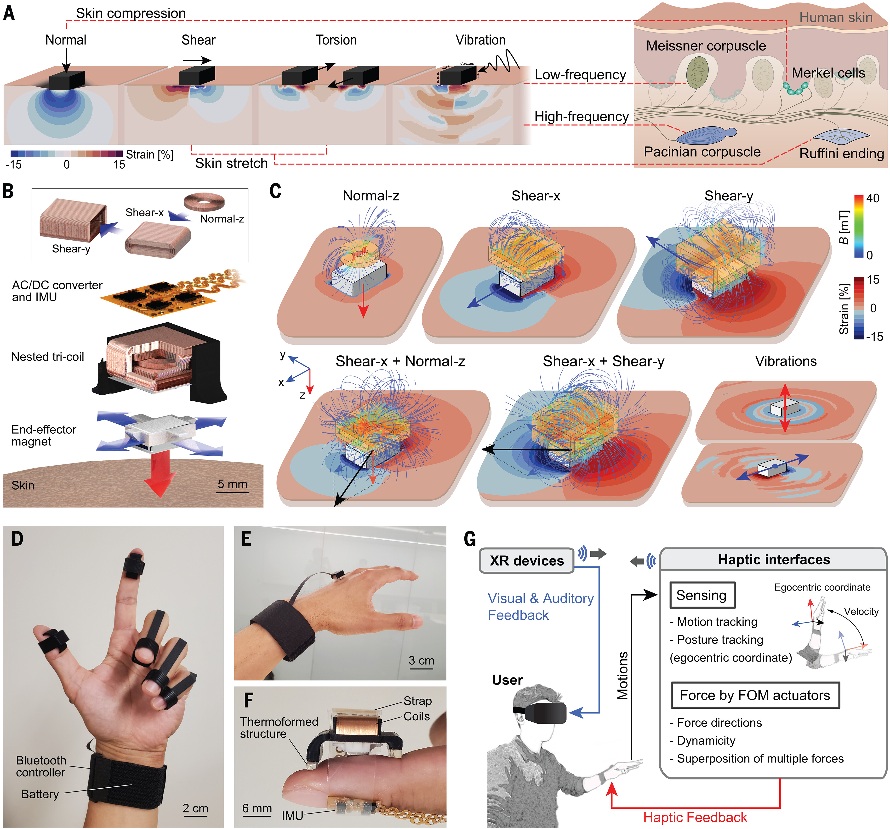

<!--
Hi! I'm Yuxuan, an M.S. student in Mechanical Engineering at **Northwestern University**. Before this, I worked as an embedded development engineer at Espressif, known for its ESP32 platform. I earned my B.S. (Hons.) in Mechanical Engineering from **Shanghai Jiao Tong University** in 2022.

 
My research interests include **actuator mechanisms**, **wearable robotics**, and **stretchable electronics**. Currently, I’m conducting research at the Simpson Querrey Institute for Bioelectronics under the supervision of Prof. John A. Rogers, focusing on multi-modal actuators and soft robotics, particularly in the areas of haptics and organoid interfaces. My expertise spans a wide range of bio-mechatronics skills, such as rapid prototyping, micro-fabrication, embedded programming and machine learning.

 
As an INTJ (Introverted-Intuitive-Thinking-Judging), I bring **resilience**, **critical thinking**, and a genuine **passion for technology** to my work. Outside of academics, I enjoy playing and singing RNB on the ukulele, playing basketball, and exploring science fiction and epic stories.
Hi! I'm Yuxuan, an M.S. student in Mechanical Engineering at Northwestern University with a GPA of 3.86/4.0. I earned my B.S. (Hons.) in Mechanical Engineering from Shanghai Jiao Tong University in 2022, graduating with all highest honors for undergraduates, including Best Thesis, Honors Degree, and Outstanding Graduate of Shanghai.

My research interests lie in actuator mechanisms, wearable robotics, and stretchable electronics. Currently, I am conducting research at the Simpson Querrey Institute for Bioelectronics under the guidance of Prof. John A. Rogers, focusing on multi-modal actuators and soft robotics, particularly in the fields of haptics and organoid studies. I have 5 years experiences in reseach, including working as RA in National Key lab of Mechanical Systems and Vibiration (MSV), Institude of Medical Robots (IMR) in SJTU. To date, I have contributed to seven papers as a lead or core author, published in journals including Nature and Science.

Beyond research, I am passionate about transforming concepts from textbooks into real-world technologies inspired by nature and everyday life. My extensive hands-on projects in novel robots and AI models have helped me develop into a full-stack engineer, with skills spanning a wide range of bio-mechatronics domains such as rapid prototyping, microfabrication, embedded programming, and machine learning.
-->
*I will be joining in Prof. [Siyi Xu](https://scholar.harvard.edu/siyixu/home)'s Group at UIUC in 25 fall, working on wearable HRI.*

 

Research Interests: wearable robotics, actuator/sensor mechanism, multi-scale robots. 
* A constant motivation to advance human-centered robotics, with career plan in academia.
* 5yrs of research experiences on robotics, lead/core author of 7 papers including ***Nature*** and ***Science***. 
* A wide skillset ranging from rapid prototyping (MechE), mechatronics system, machine learning(ECE) and bio-signal monitoring (MedE) ...

    

<i>Delivering an oral report at the Young Scholar Competition, Suzhou, 2023</i>

 
 
# 🔥 News
- *2025.03*: 🎉🎉 Our paper "*[Full freedom-of-motion actuators as advanced haptic interfaces](https://www.science.org/doi/10.1126/science.adt2481)*" has been published by ***Science***! 
- *2025.01*: Awarded "Excellent Master Dissertation of School".
- *2024.12*: 🎓 Successfully passed the Master's dissertation defense, titled "*Full Freedom-of-Motion Haptic Actuator for Efficient Information Transfer in XR*". Many thanks to my advisor, Prof. John Rogers, committee member, Prof. Edward Colgate, and best mentor ever, Dr. Kyoungho Ha! 
- *2024.10*: 🎉🎉 Our paper "*[Bioelastic state recovery for haptic sensory substitution](https://www.nature.com/articles/s41586-024-08155-9)*" has been accepted by ***Nature***! 
- *2024.01*: 🎉 Our paper "*A Robotic System For Transthoracic Puncture of Pulmonary Nodules Based on Gated Respiratory Compensation*" has been accepted by *Computer Methods and Programs in Biomedicine*. 
- *2023.05*: 🏆 Awarded 1st prize for Outstanding Young Scholar Paper at BME2023, Suzhou, China.
- *2023.01*: 🏆 Awarded the Agilent Scholarship for Excellence in Life Science. Grateful to Agilent for their support!
- *2022.06*: 🎓 Graduated from SJTU with highest honors (Best Thesis, Honor Degree, and Outstanding Graduate of Shanghai)!

 
 
# 📖 Educations

- *2022.09 - 2025.03*, M.S. in MechE, Northwestern University & Shanghai Jiao Tong University (Dual Degree)
- *2018.09 - 2022.06*, B.S. (<b>Hons.</b>) in MechE, Shanghai Jiao Tong University 

 
# 🧑‍💻 Experiences
- *2023.09 - 2025.03*, <b>Research Assistant</b>, Simpson Querrey Institute for Bioelectronics, Evanston.
  - Advisor: Prof. [John A. Rogers](https://scholar.google.com/citations?hl=en&user=VLxoLPsAAAAJ&view_op=list_works&sortby=pubdate)
<!--   - Mentors: Dr. Kyoungho Ha, Prof. [Matthew T. Flavin](https://flavinlab.io/people/), Dr. Wooyoul Maeng -->
  - Projects: Bioelastic haptic actuator, Multi-modal haptic actuator, soft robot for organoid interface
   

- *2021.09 - 2023.09*, <b>Research Assistant</b>, Institute of Biomedical Manufacturing and Life Quality Engineering, Shanghai.
  - Advisor: Prof. [Xiaojun Chen](https://scholar.google.com/citations?hl=en&user=NpzvK0kAAAAJ&view_op=list_works&sortby=pubdate)
  - Projects: robot-assisted thoracic puncture system, fiber-optic respiration sensor, temporal medical image generation
 

- *2022.01 - 2022.10*, <b>Software Development Intern</b>, [Espressif](https://www.espressif.com/), Shanghai.
  - Mentors: Zhaocheng Zhan, Li Zhou
  - Project: Mini Pupper (colabrate with Mangdang)
 
 
- *2021.06 - 2021.09*, <b>Undergraduate Research Assistant</b>, Institute of Medical Robotics, Shanghai.
  - Advisor: Prof. [Anzhu Gao](https://imr.sjtu.edu.cn/en/po_facultyv/530.html)
  - Project: redundant robot design and manipulation
 

- *2020.02 - 2021.02*, <b>Undergraduate Research Assistant</b>, Institute of Robotics, Shanghai.
  - Advisor: Prof. [Jianjun Meng](https://scholar.google.com/citations?hl=en&user=Ahr8ZzsAAAAJ)
  - Project: motor imagery (MI)-based brain-computer interface (BCI) 

 
 
# 📝 Publications 

## Ongoing Works
- [1] **Multimodal Microscaled Soft Robotic Actuator for Human Organoids Interfaces**

  W. Maeng, Z. Lyu, K. Kim, K.-H. Ha, <u>Y. Mao</u>, S. Xu, L. Praba, Y. Hwang, J. A. Rogers. Submission planned Apr. 2025

   
- [2] **Efficient Tumor Localization During Respiration with Minimal Scanning Based on Recursive Deformable Diffusion Models**

  <u>Y. Mao</u>\*, D. Li\*, W. Sun, D. Zhao, C. Chen, X. Chen. Submitted Feb. 2025

 
## Journals
- [J1] [**Full Freedom-of-Motion Actuators as Advanced Haptic Interfaces**](https://www.science.org/doi/10.1126/science.adt2481)

  K.-H. Ha\*, J. Yoo\*, S. Li\*, <u>Y. Mao</u>, S. Xu, H. Qi, H. Wu, C. Fan, H. Yuan, J.-T. Kim, M. Flavin, S. Yoo, P. Shahir, S. Kim, H.-Y. Ahn, E. Colgate, Y. Huang, J. A. Rogers. ***Science***, Mar. 2025

    

 

- [J2] [**Bioelastic State Recovery for Haptic Sensory Substitution**](https://www.nature.com/articles/s41586-024-08155-9)

  M. Flavin\*, K.-H. Ha\*, Z. Guo\*, S. Li\*, J.-T. Kim\*, T. Saxena, D. Simatos, F. Al-Najjar, <u>Y. Mao</u>, S. Bandapalli, C. Fan, D. Bai, Z. Zhang, J. Yoo, M. Park, J. Shin, A. Huang, H. Shin, Y. Huang, Z. Xie, H. Jiang, J. A. Rogers. ***Nature***, Nov. 2024

    

  
 
- [J3] [**A Robotic System For Transthoracic Puncture of Pulmonary Nodules Based on Gated Respiratory Compensation**](https://www.sciencedirect.com/science/article/abs/pii/S0169260723006612)

  D. Li\*, <u>Y. Mao</u>\*, P. Tu, H. Shi, W. Sun, D. Zhao, C. Chen, X. Chen. *Computer Methods and Programs in Biomedicine*, Jan. 2024

    

 
## Conferences

- [C1] **A Real-Time Respiratory Analysis System for PET-CT Based on Fiber-Optic Pressure Sensors**

  <u>Y. Mao</u>, P. Tu, W. Liu, Z. Liu, X. Chen. Oral, *China Biomedical Engineering Conference*, May. 2023.

    

 
- [C2] [**A Cable-Driven Hyper-Redundant Robot with Angular Sensing**](https://ieeexplore.ieee.org/document/9739505)

  <u>Y. Mao</u>, J. Yu, L. Wang, Y. Zou, Z. Lin, W. Chen, A. Gao. Oral, *IEEE International Conference on Robotics and Biomimetics (ROBIO)*, Nov. 2021.

    

 
  (\* Equal Authorship)

 
 
# 🤖 Projects

Beyond research, I am passionate about designing innovative robots and AI models inspired by nature and daily life, translating concepts from textbooks into real-world technologies that enhance people's lives.

## Robots and Mechanisms

**Wrist Rehabilitation Assistive Device Based on 3-RRR Mechanism**

<u>Y. Mao</u>, P. Lin, R. Liu, B. Liang, A. Sun, Y. Jin

- Utilizing an R-R-R spherical parallel mechanism, this device provides independent rotational movements in three degrees of freedom (DoF), covering the full range of wrist motion.
- Through force sensors and IMU, it enables accurate trajectory reproduction with controlled resistance, allowing wrist-injured patients to train muscles across 3 DoF with adaptive damping.
- **Excellence in Technology Award**, 2023 Mechatronics Fair, School of Mechanical Engineering.

 

**Mini Pupper: A Lightweight, modular 12-DOF quadruped robot based on ESP32**
[Project](https://www.kickstarter.com/projects/mdrobotkits/mini-pupper-2-open-source-ros2-robot-kit-for-dreamers) | [Video](https://youtu.be/KGVOi1Mrjb0?si=rhBAEWGgtXD9CqYx&t=138) 

MangDang Tech, <u>Y. Mao</u>, Z. Zhang

- Developed a lightweight, modular 12-DOF quadruped robot with all-stack skills.
- Verified the compatibility of ESP32 platform with Micro-ROS to expand its applicability in robotics.

 

Patent Granted

**Jumpiter: A Cam-Powered Dual-Mode Mobile-Jumping Robot**

X. Xu, <u>Y. Mao</u>, H. Bai, Z. Mei, M. Xia

- The robot can perform both mobile motion and periodic jump reaching heights of up to 400 mm. It stores and releases energy through a cam and spring mechanism, while maintaining in-air orientation by sensing and adjusting its position mid-air using an IMU and flywheel.
- I was responsible for the electrical systems, communication protocols, and implementing the closed-loop control system.
- Granted utility model patent(CN215904637U).

 

1st Prize

**A Curvature-Adaptive Roller Clamping Mechanism for Heavy Load Transportation on Staircases**

H. Yan, <u>Y. Mao</u>, H. Mao, Z. Zhang

- Adaptable roller system that conforms to various staircase shapes and smoothly navigates corners.
- Integrated with a loading lever, enabling manual transportation of heavy loads with significantly reduced effort.
- **1st Prize**, Shanghai Mechanical Engineering Innovation Competition; **2nd Prize**, National Mechanical Engineering Innovation Competition

 

## Artificial Intelligence

**Dynamic Multi-Robot Swarm Formation Based on Distributed Control**

<u>Y. Mao</u>, J. Yu, Z. Wang, F. Du

- Programmed a 5-robot swarm on the ROS using consensus algorithms to achieve distributed control, allowing dynamic formation adjustments based on obstacle detection

 

**Cooperation and Confrontation in Multi-Agent Reinforcement Learning for RoboCup**

<u>Y. Mao</u>, J. Liang, Z. Li, S. Chen

- Implemented a 2v2 soccer simulation training in Unity 3D using the Multi-Agents Posthumous Credit Assignment (MA-POCA) model, where agents demonstrated intelligent coordination in both offense and defense.

 

**Real-time Chord Decomposition for Guitar Playing using FFT**

<u>Y. Mao</u>

- Developed a program in LABView for real-time frequency domain analysis of captured audio using FFT, achieving 90% accuracy in decomposing guitar chords.

 

<!--
# 🔧 Skills
As a researcher and engineer, I have developed comprehensive **full-stack** skills in bio-mechatronics, which I have further refined through hands-on experience in various projects.

- **Mechanical**:
    - CAD (Solidworks, AutoCAD, FreeCAD, iSight), Simulation (Abaqus, Adams)
    - Rapid Prototyping (3D Printing (FDM and SLA), Laser Cutting), CNC machining
    - Motor control (DC, Step, Servo), Valve control (Solenoid, Proportional)
- **Electrical**:
    - (Micro)Soldering, wiring
    - Embedded System Development (Arduino, STM32, ESP32)
    - Signal Processing
- **Programming**:
    - MATLAB/Simulink, LabVIEW
    - C/C++, Python, Swift
- **Robotics**:
    - ROS/ROS2/MicroROS, V-REP/CoppeliaSim, Gazebo
    - Protocols (UART, I2C, SPI, CAN)
- **Equipments**:
    - Tensile/Compression Tester, Dynamic Fatigue Tester
    - Vital Signs Monitor (SPO2, HR, Resp), EEG Cap
    - *NDI* Optical/Electromagnetic Tracker
- **Others**:
    - Micro-Fabrication, Thin-film Coating Processes
    - Digital Image Correlation (DIC)
    - Statistical/Machine Learning
    - ...
-->
<!--
# 📷 Album
While working diligently and efficiently, I also make it a priority to nurture both my body and mind.

 

    

<i>With Master's Defense Committee, Evanston, IL, 2024</i>

 

 

    

<i>With Jinda at SJTU Anual Running Festival, Shanghai, 2021</i>

 
-->

<!--
 

    

<i>Dancing with Qianru at the graduation prom, shanghai, 2023</i>

 
-->

<!--

    

<i>Presenting in TYACHT outstanding student selection, Shanghai, 2021</i>

 

    

<i>With team of RRR-Robot at dawn before the final report, Shanghai, 2023</i>

 

    

<i>With Team members after winning VEX Competition, Shanghai, 2019</i> 

-->

<!--

    

<i>Cosplay with classmates of LOL MV Rise, Shanghai, 2019</i>

-->

<!--

    

<i>After winning ME design competition, Shanghai, 2020</i>

-->

<!--

    

<i>with friends at Salty Lake City</i>

-->

<!--

    

<i>With colleagues of student union, Shanghai, 2020</i>

    

<i>With Beichen and Ziyu after submitting paper to MEM, Shanghai, 2020</i>

    

<i>holding a reading salon in the honors class, Shanghai, 2019

-->
