






Hi! I'm Yuxuan, an M.S. student in Mechanical Engineering at **Northwestern University**. Before this, I worked as an embedded development engineer at Espressif, known for its ESP32 platform. I earned my B.S. (Hons.) in Mechanical Engineering from **Shanghai Jiao Tong University** in 2022.

 
My research interests include **actuator mechanisms**, **wearable robotics**, and **stretchable electronics**. Currently, I’m conducting research at the Simpson Querrey Institute for Bioelectronics under the supervision of Prof. John A. Rogers, focusing on multi-modal actuators and soft robotics, particularly in the areas of haptics and organoid interfaces. My expertise spans a wide range of bio-mechatronics skills, such as rapid prototyping, micro-fabrication, embedded programming and machine learning.

 
As an INTJ (Introverted-Intuitive-Thinking-Judging), I bring **resilience**, **strategic thinking**, and a genuine **passion for technology** to my work. Outside of academics, I enjoy playing and singing RNB on the ukulele, playing basketball, and exploring science fiction and epic stories.

    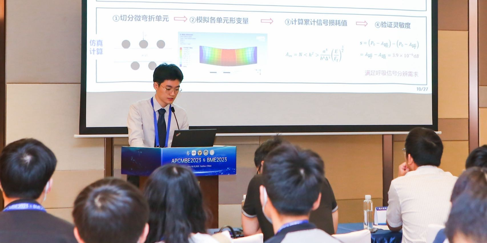

<i>Delivering an oral report at the Young Scholar Competition, Suzhou, 2023</i>

 
 
# 🔥 News
- *2024.10*: 🎉🎉 Our paper "Bioelastic state recovery for haptic sensory substitution" has been accepted by ***Nature***! 
- *2024.01*: 🎉 Our paper "A Robotic System For Transthoracic Puncture of Pulmonary Nodules Based on Gated Respiratory Compensation" has been accepted by *Computer Methods and Programs in Biomedicine*. 
- *2023.10*: 🔬 Completed my onboarding at the Simpson Querrey Institute for Bioelectronics.
- *2023.09*: 💜🐈‍⬛ My journey at Northwestern University begins!
- *2023.05*: 🏆 Awarded 1st prize for Outstanding Young Scholar Paper at BME2023, Suzhou, China.
- *2023.01*: 🎖️ Awarded the Agilent Scholarship for Excellence in Life Science. Grateful to Agilent for their support!
- *2022.06*: 🎓 Graduated from SJTU with highest honors (Best Thesis, Honor Degree, and Outstanding Graduate of Shanghai)!

 
 
# 📖 Educations

- *2023.09 - present*, M.S. in MechE, <b>Northwestern University</b>
  - GPA: 3.86/4.00
  - Coursework: Bio-electronics, Surface Engineering, AI in Robotics, Vibrations and Acoustics
  

- *2018.09 - 2022.06*, B.S. (Hons.) in MechE, <b>Shanghai Jiao Tong University</b> 
  
  ([#2](https://www.usnews.com/education/best-global-universities/mechanical-engineering) best global school for MechE)
  - GPA: 3.65/4.00 (Zhiyuan Honors Program for top 5% students)
  - Coursework: Mechatronics, Design/Manufacturing, Solid/Fluid Mechanics, Modern Control Theory

 
 
# 🧑‍💻 Experiences
- *2023.09 - present*, <b>Research Assistant</b>, Simpson Querrey Institute for Bioelectronics, Evanston.
  - Advisor: Prof. [John A. Rogers](https://scholar.google.com/citations?hl=en&user=VLxoLPsAAAAJ&view_op=list_works&sortby=pubdate), Email: jrogers@northwestern.edu
  - Mentors: Dr. Kyoungho Ha, Prof. [Matthew T. Flavin](https://flavinlab.io/people/), Dr. Wooyoul Maeng
  - Projects: Bioelastic haptic actuator, Multi-modal haptic actuator, soft robot for organoid interface
  

- *2021.09 - 2023.09*, <b>Research Assistant</b>, Institute of Biomedical Manufacturing and Life Quality Engineering, Shanghai.
  - Advisor: Prof. [Xiaojun Chen](https://scholar.google.com/citations?hl=en&user=NpzvK0kAAAAJ&view_op=list_works&sortby=pubdate), Email: xiaojunchen@sjtu.edu.cn
  - Projects: robot-assisted thoracic puncture system, fiber-optic respiration sensor, tumor localzation during respiration

- *2022.01 - 2022.10*, <b>Software Development Intern</b>, [Espressif](https://www.espressif.com/), Shanghai.
  - Mentors: Zhaocheng Zhan, Li Zhou
  - Projects: Mini Pupper (colabrate with Mangdang)

- *2021.06 - 2021.09*, <b>Undergraduate Research Assistant</b>, Institute of Medical Robotics, Shanghai.
  - Advisor: Prof. [Anzhu Gao](https://imr.sjtu.edu.cn/en/po_facultyv/530.html), Email: anzhu_gao@sjtu.edu.cn
  - Project: redundant robot design and manipulation

- *2020.02 - 2021.02*, <b>Undergraduate Research Assistant</b>, Institute of Robotics, Shanghai.
  - Advisor: Prof. [Jianjun Meng](https://scholar.google.com/citations?hl=en&user=Ahr8ZzsAAAAJ)
  - Project: motor imagery (MI)-based brain-computer interface (BCI) 

 
# 🤝 Outreach
- *2024.09 - present*, <b>Teaching Assistant</b>, ME449 Robotic Manipulation, Evanston.
  - Instructor: Prof. [Kevin Lynch](https://scholar.google.com/citations?user=yCpbkPAAAAAJ&hl=en)
  - Assisted with course material preparation, grading, and holding office hour for a class of 80 students.

- *2020.09 - 2021.06*, <b>Minister of Secretariat</b>, Student Union of Zhiyuan College, Shanghai.
  - Organized and led activities for the student union and inter-communication with sister schools. Handled commercial outreach and led press releases.

<!--

    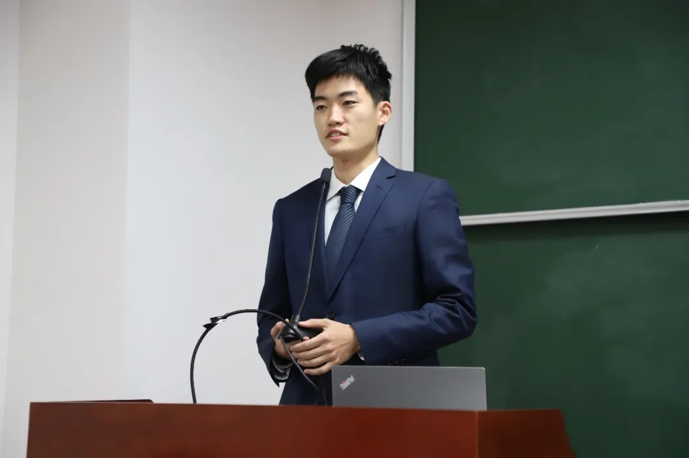

<i>Delivering the anual report of student union, Shanghai, 2020</i>

-->

- *2020.07 - 2021.07*, <b>Fellow</b>, Zhixing China-US University Student Leader Academy, Beijing.
  - Participated in the U.S.-China Youth Leader Dialogue, conducting field research on sustainable development and technology through visits to Jingzhou.

<!--

    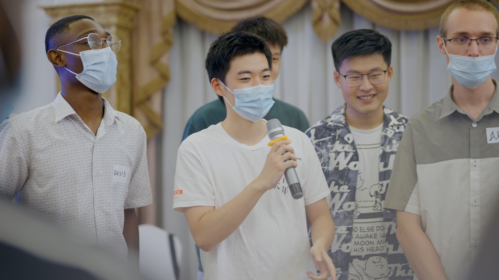

<i>Participating in the Zhixing Roundtable on Sustainable Development, Hubei, 2020.</i>

-->

- *2020.02 - 2020.12*, <b>Peer Tutor</b>, Top Scholars Club, Shanghai.
  - Conducted weekly Q-A and review sessions for 2 students; recognized as an Outstanding Tutor.

- *2019.07 - 2019.08*, <b>Volunteer Teacher</b>, GreatWall Education Assistance Program, Hunan.
  - Taught ~700 Grade-10 students at a remote school; recognized as an Outstanding Individual for teaching excellence.

    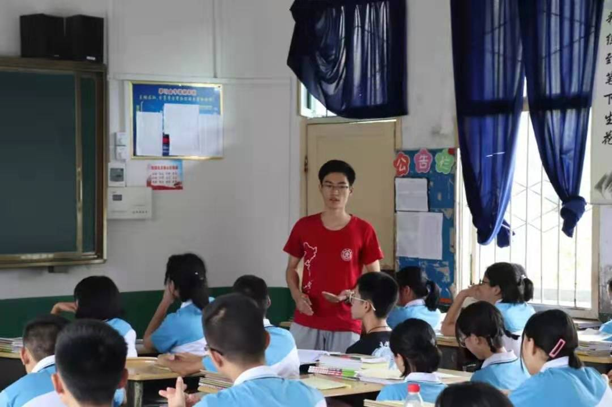

<i>Teaching a class at a rural middle school, Xinhuang, 2019</i>

 
 
# 🏆 Honors and Awards
- *2023* 1st Prize, Outstanding Paper of Young Scholar, BME2023(China)
- *2023* Agilent Scholarship (Top 0.6%, 5/773)
- *2022* Excellent Bachelor Thesis of SJTU (Top 1%, 40/3928)
- *2022* Outstanding Graduate of Shanghai (Top 2%)
- *2019,2020,2021* Zhiyuan Honors Scholarship (Top 5%)
- *2021* Guanghua Scholarship
- *2021* TYACHT Outstanding Student (Top 1%, 5/424)
- *2021* Zhiyuan Outstanding Leader Scholarship
- *2021* COSCO-shipping Scholarship
- *2020* 1st Prize, Shanghai Mechanical Engineering Innovation Competition
- *2019* Shanghai Scholarship (Top 1%, 1/206)

    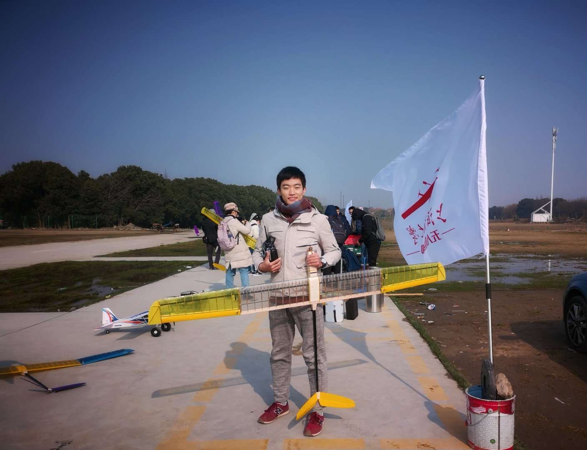

<i>Before first flight test of SJTU Drone Club, Shanghai, 2019</i>

 
 
# 📝 Publications 
As the first author or lead co-author, I'm well-trained, and gained extensive experience across all stages of research --from conceptualization to characterization, formal analysis, and manuscript preparation. My work continuously focuses on the diverse interactions between robots/actuators and the human body, with applications in rehabilitation, assistive technologies, and extended reality systems.

## Ongoing Works

- [1] **Full Freedom-of-Motion Actuators as Advanced Haptic Interfaces**

  K.-H. Ha\*, J. Yoo\*, S. Li\*, <u>Y. Mao</u>, S. Xu, H. Qi, H. Wu, C. Fan, H. Yuan, J.-T. Kim, M. Flavin, S. Yoo, P. Shahir, S. Kim, H.-Y. Ahn, E. Colgate, Y. Huang, J. A. Rogers. ***Science*** (Under Review), Sep. 2024

 
- [2] **Multimodal Microscaled Soft Robotic Actuator for Human Organoids Interfaces**

  W. Maeng, Z. Lyu, K. Kim, K.-H. Ha, <u>Y. Mao</u>, S. Xu, L. Praba, Y. Hwang, J. A. Rogers. Submission planned Dec. 2024

   
- [3] **Efficient Tumor Localization During Respiration with Minimal Scanning Based on Recursive Deformable Diffusion Models**

  <u>Y. Mao</u>\*, D. Li\*, W. Sun, D. Zhao, C. Chen, X. Chen. Submission planned Dec. 2024

 
## Journals
- [J1] **Bioelastic State Recovery for Haptic Sensory Substitution**

  M. Flavin\*, K.-H. Ha\*, Z. Guo\*, S. Li\*, J.-T. Kim\*, T. Saxena, D. Simatos, F. Al-Najjar, <u>Y. Mao</u>, S. Bandapalli, C. Fan, D. Bai, Z. Zhang, J. Yoo, M. Park, J. Shin, A. Huang, H. Shin, Y. Huang, Z. Xie, H. Jiang, J. A. Rogers. ***Nature*** (Accepted), Oct. 2024
  
 
- [J2] [**A Robotic System For Transthoracic Puncture of Pulmonary Nodules Based on Gated Respiratory Compensation**](https://www.sciencedirect.com/science/article/abs/pii/S0169260723006612)

  D. Li\*, <u>Y. Mao</u>\*, P. Tu, H. Shi, W. Sun, D. Zhao, C. Chen, X. Chen. *Computer Methods and Programs in Biomedicine*, Jan. 2024

    

 
## Conferences

- [C1] **A Real-Time Respiratory Analysis System for PET-CT Based on Fiber-Optic Pressure Sensors**

  <u>Y. Mao</u>, P. Tu, W. Liu, Z. Liu, X. Chen. Oral, *China Biomedical Engineering Conference*, May. 2023.

    

 
- [C2] [**A Cable-Driven Hyper-Redundant Robot with Angular Sensing**](https://ieeexplore.ieee.org/document/9739505)

  <u>Y. Mao</u>, J. Yu, L. Wang, Y. Zou, Z. Lin, W. Chen, A. Gao. Oral, *IEEE International Conference on Robotics and Biomimetics (ROBIO)*, Nov. 2021.

    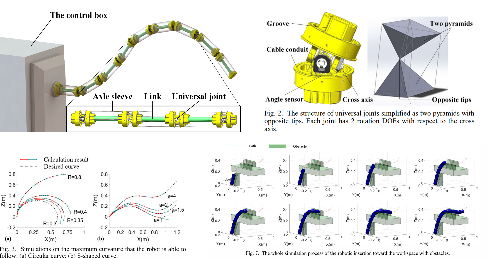

 
  (\* Equal Authorship)

 
 
# 🤖 Projects

Beyond research, I am passionate about designing innovative robots and AI models inspired by nature and daily life, translating concepts from textbooks into real-world technologies that enhance people's lives. My extensive hands-on experience has enabled me to grow into a full-stack engineer.

## Robots and Mechanisms

**Wrist Rehabilitation Assistive Device Based on 3-RRR Mechanism**

<u>Y. Mao</u>, P. Lin, R. Liu, B. Liang, A. Sun, Y. Jin

- Utilizing an R-R-R spherical parallel mechanism, this device provides independent rotational movements in three degrees of freedom (DoF), covering the full range of wrist motion.
- Through force sensors and IMU, it enables accurate trajectory reproduction with controlled resistance, allowing wrist-injured patients to train muscles across 3 DoF with adaptive damping.
- Excellence in Technology Award, 2023 Mechatronics Fair, School of Mechanical Engineering.

 

**Mini Pupper: A Lightweight, modular 12-DOF quadruped robot based on ESP32**
[Project](https://www.kickstarter.com/projects/mdrobotkits/mini-pupper-2-open-source-ros2-robot-kit-for-dreamers) | [Video](https://youtu.be/KGVOi1Mrjb0?si=rhBAEWGgtXD9CqYx&t=138) 

MangDang Tech, <u>Y. Mao</u>, Z. Zhang

- Developed a lightweight, modular 12-DOF quadruped robot with all-stack skills.
- Verified the compatibility of ESP32 platform with Micro-ROS to expand its applicability in robotics.

 

Patent Granted

**Jumpiter: A Cam-Powered Dual-Mode Mobile-Jumping Robot**

X. Xu, <u>Y. Mao</u>, H. Bai, Z. Mei, M. Xia

- The robot can perform mobile-periodic jumps reaching heights of up to 400 mm. It stores and releases energy through a cam and spring mechanism, while maintaining precise aerial control by sensing and adjusting its position mid-air using an IMU and flywheel.
- I was responsible for the electrical systems, communication protocols, and implementing the closed-loop control system.
- Granted utility model patent(CN215904637U).

 

1st Prize

**A Curvature-Adaptive Roller Clamping Mechanism for Heavy Load Transportation on Staircases**

H. Yan, <u>Y. Mao</u>, H. Mao, Z. Zhang

- Adaptable roller system that conforms to various staircase shapes and smoothly navigates corners.
- Integrated with a loading lever, enabling manual transportation of heavy loads with significantly reduced effort.
- 1st Prize, Shanghai Mechanical Engineering Innovation Competition; 2nd Prize, National Mechanical Engineering Innovation Competition

 

## Artificial Intelligence

**Dynamic Multi-Robot Swarm Formation Based on Distributed Control**

<u>Y. Mao</u>, J. Yu, Z. Wang, F. Du

- Programmed a 5-robot swarm on the ROS using consensus algorithms to achieve distributed control, allowing dynamic formation adjustments based on obstacle detection

 

**Cooperation and Confrontation in Multi-Agent Reinforcement Learning for RoboCup**

<u>Y. Mao</u>, J. Liang, Z. Li, S. Chen

- Implemented a 2v2 soccer simulation training in Unity 3D using the Multi-Agents Posthumous Credit Assignment (MA-POCA) model, where agents demonstrated intelligent coordination in both offense and defense.

 

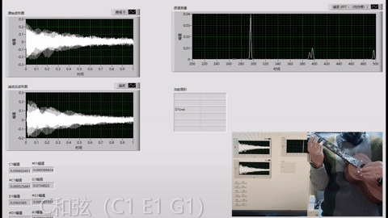

**Real-time Chord Decomposition for Guitar Playing using FFT**

<u>Y. Mao</u>

- Developed a program in LABView for real-time frequency domain analysis of captured audio using FFT, achieving 90% accuracy in decomposing guitar chords.

 

# 🔧 Skills
- **Mechanical**:
    - CAD (Solidworks, AutoCAD, FreeCAD, iSight), Simulation (Abaqus, Adams)
    - Rapid Prototyping (3D Printing (FDM and SLA), Laser Cutting)
    - Mechatronics Implementation (Motors (DC, Step, Servo))
    - Pneumatic Implementation (Valves (Solenoid, Proportional))
- **Electrical**:
    - (Micro)Soldering, wiring
    - Embedded System Development (Arduino, STM32, ESP32)
    - Signal Processing
- **Programming**:
    - MATLAB/Simulink, LabVIEW
    - C/C++, Python, Swift
- **Robotics**:
    - ROS/ROS2/MicroROS, V-REP/CoppeliaSim, Gazebo
    - Protocols (UART, I2C, SPI, CAN)
- **Equipments**:
    - Tensile/Compression Tester, Dynamic Fatigue Tester
    - Vital Signs Monitor (SPO2, HR, Resp), EEG Cap
    - *NDI* Optical/Electromagnetic Tracker
- **Others**:
    - Micro-Fabrication, Thin-film Coating Processes
    - Digital Image Correlation (DIC)
    - Statistical/Machine Learning
    - ...

<!--
# 🎸 Hobbies
While working diligently and efficiently, I also make it a priority to nurture both my body and mind.

 

    

<i>With Jinda at SJTU Anual Running Festival, Shanghai, 2021</i>

 

 

    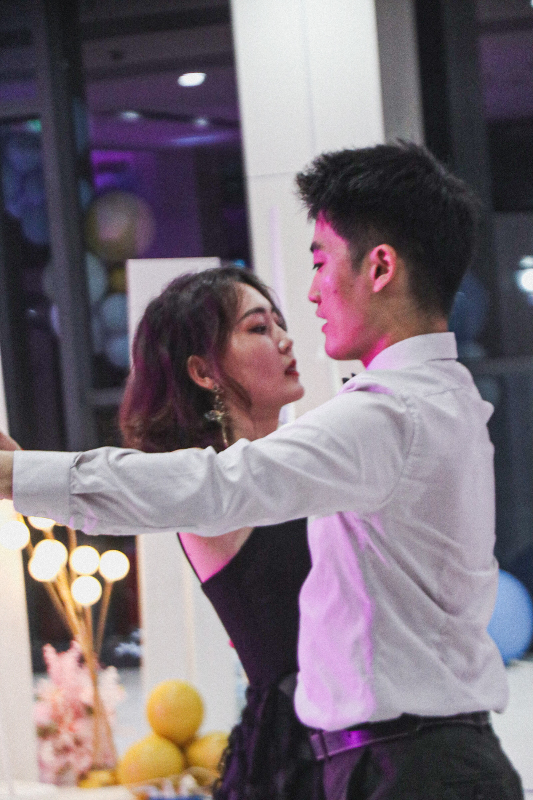

<i>Dancing with Qianru at the graduation prom, shanghai, 2023</i>

 
-->

<!--

    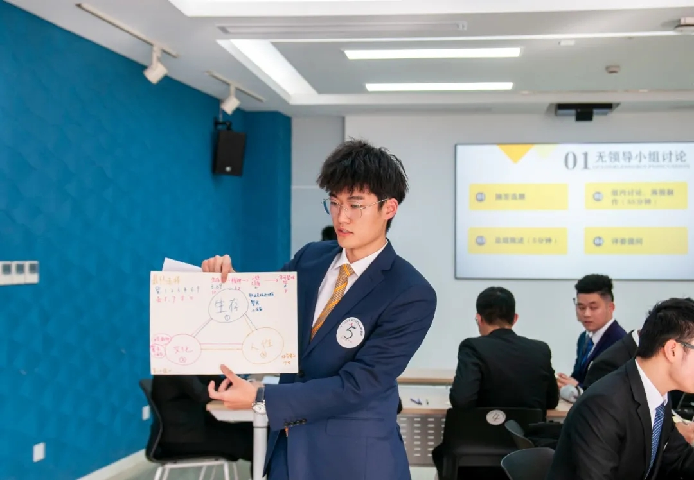

<i>Presenting in TYACHT outstanding student selection, Shanghai, 2021</i>

-->

<!--
 

    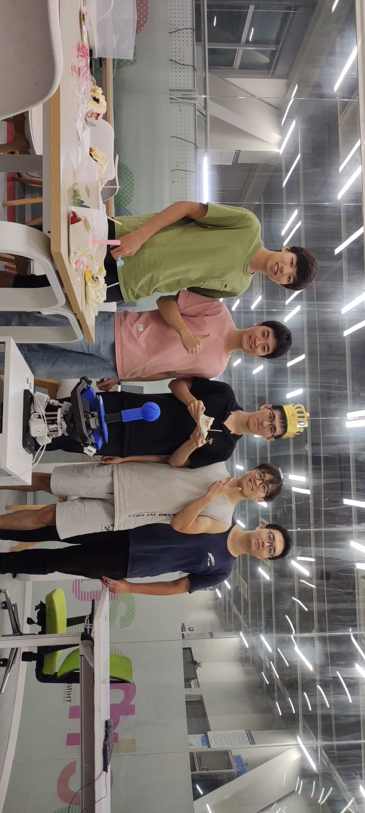

<i>With team of RRR-Robot at dawn before the final report, Shanghai, 2023</i>

-->

<!--
 

    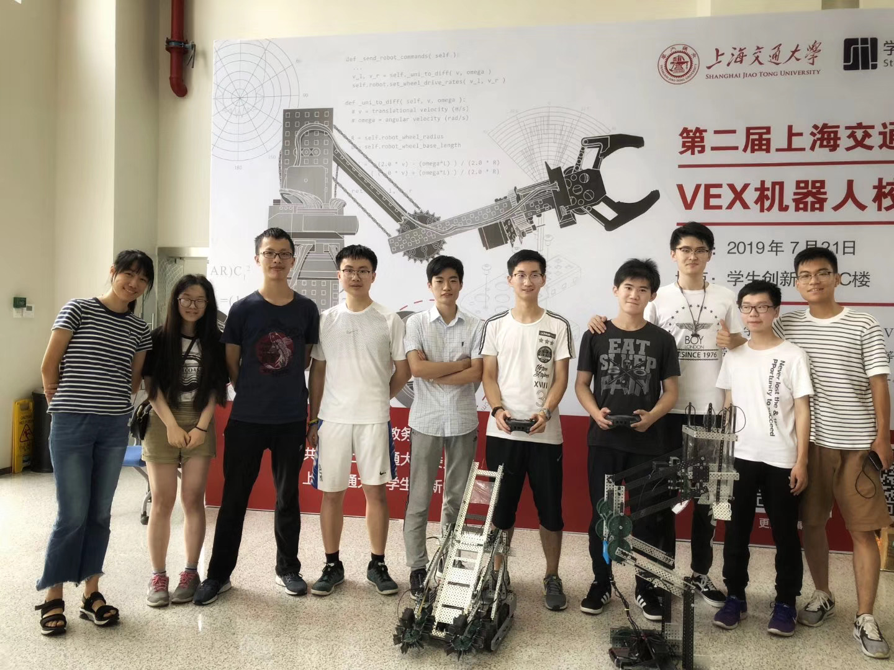

<i>With Team members after winning VEX Competition, Shanghai, 2019</i> 

-->

<!--

    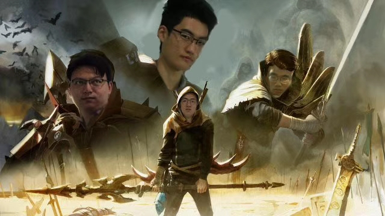

<i>Cosplay with classmates of LOL MV Rise, Shanghai, 2019</i>

-->

<!--

    

<i>After winning ME design competition, Shanghai, 2020</i>

-->

<!--

    

<i>with friends at Salty Lake City</i>

-->

<!--

    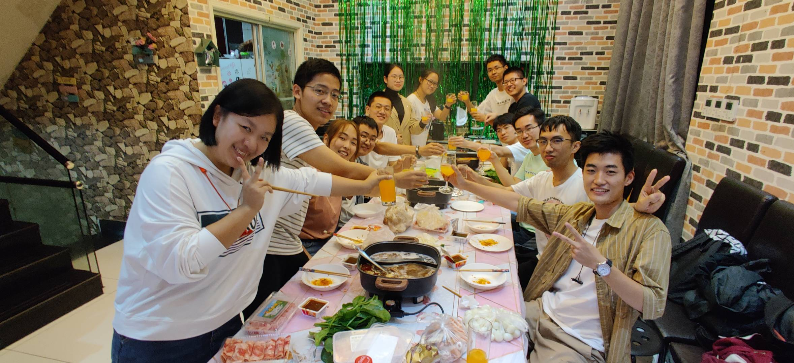

*With colleagues of student union*

-->

<!--

    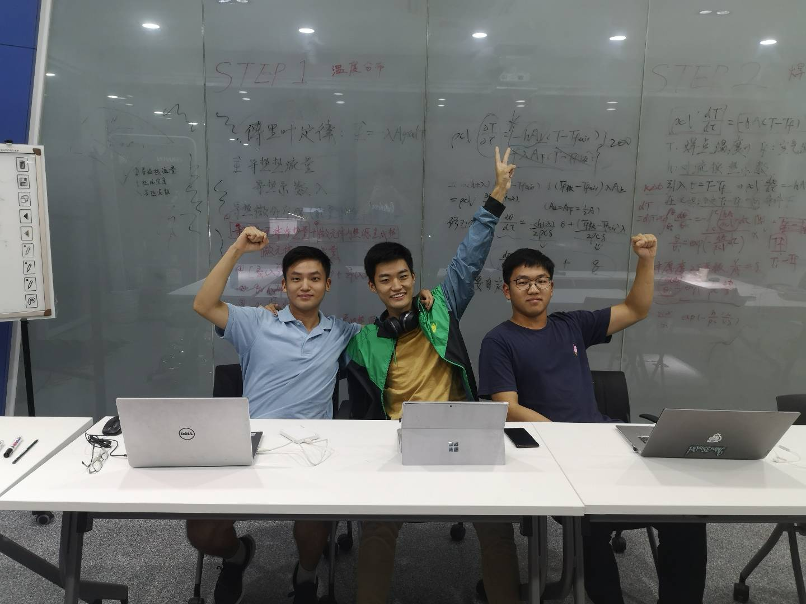

*With Beichen and Ziyu after submitting paper to MEM*

-->

<!--

    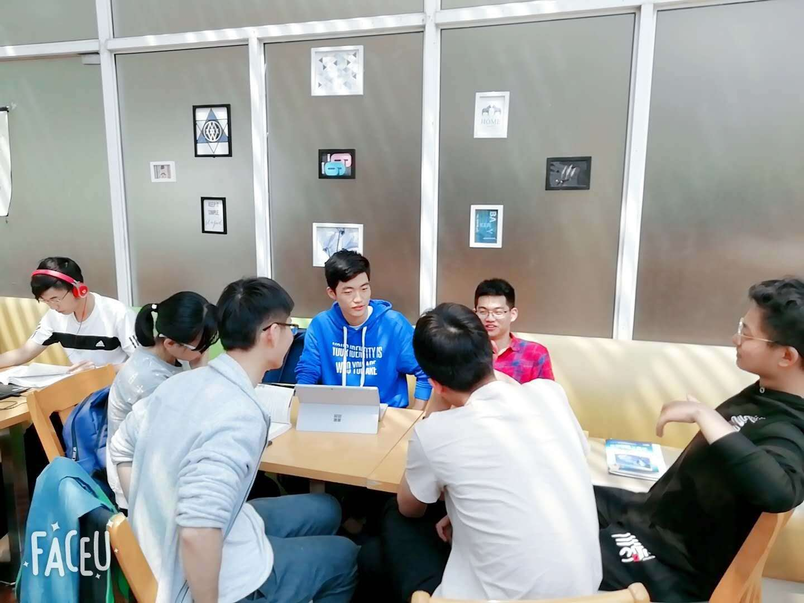

*holding a reading salon*

-->
