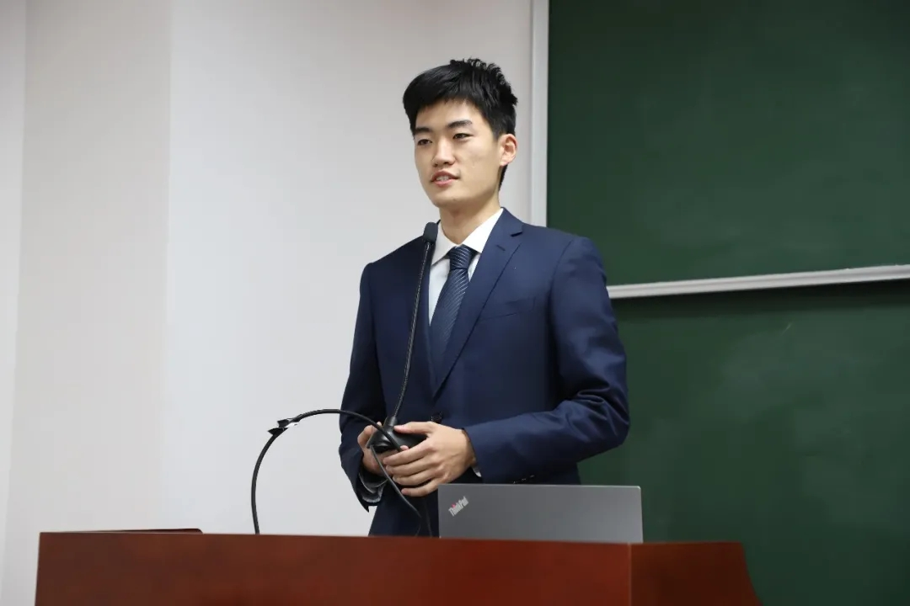
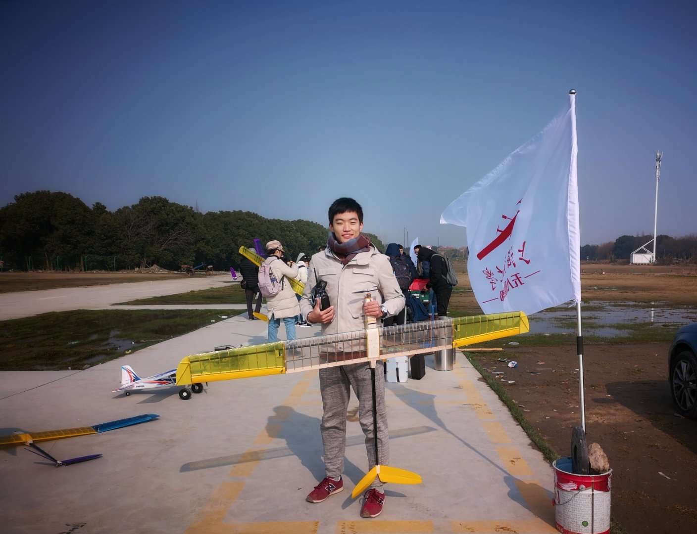

 
# 📖 Educations

- *2023.09 - present*, M.S. in MechE, Northwestern University
  

- *2018.09 - 2022.06*, B.S. (<b>Hons.</b>) in MechE, Shanghai Jiao Tong University 

 
 
# 🧑‍💻 Experiences
- *2023.09 - 2025.03*, <b>Research Assistant</b>, Simpson Querrey Institute for Bioelectronics, Evanston.
  - Advisor: Prof. [John A. Rogers](https://scholar.google.com/citations?hl=en&user=VLxoLPsAAAAJ&view_op=list_works&sortby=pubdate)
<!--   - Mentors: Dr. Kyoungho Ha, Prof. [Matthew T. Flavin](https://flavinlab.io/people/), Dr. Wooyoul Maeng -->
  - Projects: Bioelastic haptic actuator, Multi-modal haptic actuator, soft robot for organoid interface
   

- *2021.09 - 2023.09*, <b>Research Assistant</b>, Institute of Biomedical Manufacturing and Life Quality Engineering, Shanghai.
  - Advisor: Prof. [Xiaojun Chen](https://scholar.google.com/citations?hl=en&user=NpzvK0kAAAAJ&view_op=list_works&sortby=pubdate)
  - Projects: robot-assisted thoracic puncture system, fiber-optic respiration sensor, temporal medical image generation
 

- *2022.01 - 2022.10*, <b>Software Development Intern</b>, [Espressif](https://www.espressif.com/), Shanghai.
  - Mentors: Zhaocheng Zhan, Li Zhou
  - Project: Mini Pupper (colabrate with Mangdang)
 
 
- *2021.06 - 2021.09*, <b>Undergraduate Research Assistant</b>, Institute of Medical Robotics, Shanghai.
  - Advisor: Prof. [Anzhu Gao](https://imr.sjtu.edu.cn/en/po_facultyv/530.html)
  - Project: redundant robot design and manipulation
 

- *2020.02 - 2021.02*, <b>Undergraduate Research Assistant</b>, Institute of Robotics, Shanghai.
  - Advisor: Prof. [Jianjun Meng](https://scholar.google.com/citations?hl=en&user=Ahr8ZzsAAAAJ)
  - Project: motor imagery (MI)-based brain-computer interface (BCI) 

 
# 🤝 Outreach
- *2024.09 - 2024.12*, <b>Teaching Assistant</b>, ME449 Robotic Manipulation, Evanston.

 

- *2020.09 - 2021.06*, <b>Minister of Secretariat</b>, Student Union of Zhiyuan College, Shanghai.
<!--  - Led activities for the student union and interactions with sister schools. Handled commercial outreach and led press releases.-->
 

<!--

    

<i>Delivering the anual report of student union, Shanghai, 2020</i>

-->

- *2020.07 - 2021.07*, <b>Fellow</b>, Zhixing China-US University Student Leader Academy, Beijing.
<!--  - Participated in the Youth Leader Dialogue, conducting field research on sustainable technology through visits to Jingzhou.-->
 

<!--

    

<i>Participating in the Zhixing Roundtable on Sustainable Development, Hubei, 2020.</i>

-->

- *2020.02 - 2020.12*, <b>Peer Tutor</b>, Academic Aid Center, Shanghai.
<!--  - Conducted weekly Q-A and review sessions for 2 students; recognized as an Outstanding Tutor.-->

 
- *2019.07 - 2019.08*, <b>Volunteer Teacher</b>, GreatWall Education Assistance Program, Hunan.
<!--  - Taught ~700 Grade-10 students at a remote school; recognized as an Outstanding Individual for teaching excellence.-->

    

<i>Teaching a class at a rural middle school, Xinhuang, 2019</i>

 
 
# 🏆 Honors and Awards
- *2025* Excellent Master Dissertation of School of ME (Top 10%)
- *2023* **1st Prize**, Outstanding Paper of Young Scholar, BME2023(China)
- *2023* Agilent Scholarship (**Top 0.6%**)
- *2022* Excellent Bachelor Thesis of SJTU (**Top 1%**)
- *2022* Outstanding Graduate of Shanghai (**Top 2%**)
- *2019,2020,2021* Zhiyuan Honors Scholarship (Top 5%)
- *2021* Guanghua Scholarship
- *2021* TYACHT Outstanding Student (**Top 1%**)
- *2021* Zhiyuan Outstanding Leader Scholarship
- *2021* COSCO-shipping Scholarship
- *2020* **1st Prize**, Shanghai Mechanical Engineering Innovation Competition
- *2019* Shanghai Scholarship (**Top 1%**)

    

<i>Before first flight test of SJTU Drone Club, Shanghai, 2019</i>

 
 
